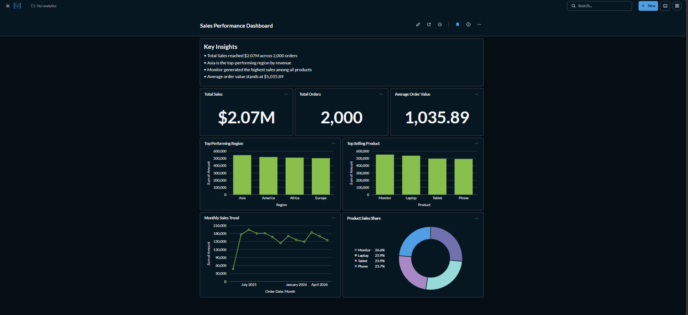

# Mini Data Platform

## Overview

This project is an end-to-end data platform built to process and analyze sales data using modern data engineering tools. It generates synthetic sales data, stores raw files in MinIO, processes them with Apache Airflow, loads transformed data into PostgreSQL, and visualizes KPIs in Metabase.


# Architecture

```text
+-------------------+
| Data Generation   |
| Python Script     |
+---------+---------+
          |
          v
+-------------------+
| MinIO             |
| Raw CSV Storage   |
+---------+---------+
          |
          v
+-------------------+
| Apache Airflow    |
| ETL Pipeline      |
+---------+---------+
          |
          v
+-------------------+
| PostgreSQL        |
| Data Warehouse    |
+---------+---------+
          |
          v
+-------------------+
| Metabase          |
| KPI Dashboard     |
+-------------------+
```

# Tech Stack

* Python
* Apache Airflow
* MinIO
* PostgreSQL
* Metabase
* Docker Compose
* Pytest
* GitHub Actions

# ETL Pipeline

DAG:

```text
sales_etl_pipeline
```

Pipeline flow:

```text
check_source → extract → transform → validate → load
```

# Incremental Loading

The pipeline checks the latest `order_date` in PostgreSQL and loads only new records. This prevents duplicate loading and improves pipeline efficiency.

# Dashboard

## Metabase Sales Dashboard

KPIs included:

* Total Sales
* Average Order Value
* Sales by Product
* Sales by Region
* Daily Sales Trend



# Project Structure

```text
mini-data-platform/
├── airflow-config/
├── dags/
├── data/
├── scripts/
├── sql/
├── src/
├── tests/
├── screenshots/
├── .github/workflows/
├── docker-compose.yml
├── requirements.txt
└── README.md
```

# Run the Project

## Setup

```bash
python3 -m venv .venv
source .venv/bin/activate

pip install -r requirements.txt
docker compose up -d
```

## Generate and Upload Data

```bash
python3 scripts/generate_sample_data.py
python3 scripts/setup_minio.py
```

## Run Pipeline

Open Airflow:

```text
http://localhost:8088
```

Login:

```text
admin / admin
```

Trigger DAG:

```text
sales_etl_pipeline
```

## Service Access

| Service       |                   URL |
| ------------- | --------------------: |
| Airflow       | http://localhost:8088 |
| MinIO Console | http://localhost:9001 |
| Metabase      | http://localhost:3001 |

## Run Tests

```bash
pytest tests/
```

# Key Learnings

* ETL pipeline orchestration with Apache Airflow
* Raw data storage with MinIO
* Data cleaning and validation with Python
* Loading transformed data into PostgreSQL
* KPI dashboard development with Metabase
* Deploying services with Docker Compose
* CI/CD automation for data pipelines with GitHub Actions

# Conclusion

This project demonstrates an end-to-end data pipeline from data ingestion to analytics reporting using modern data engineering tools.
